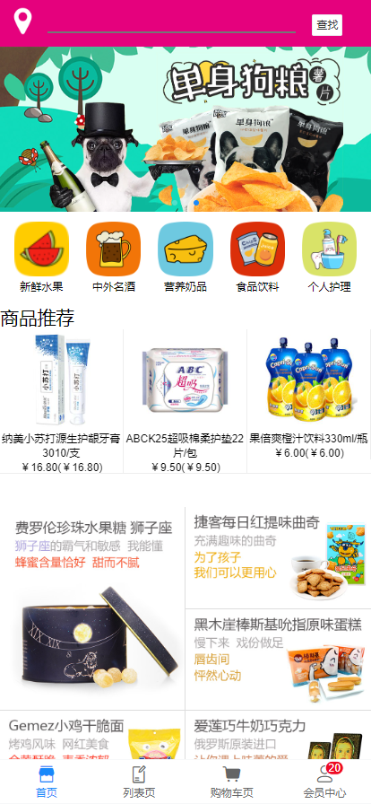
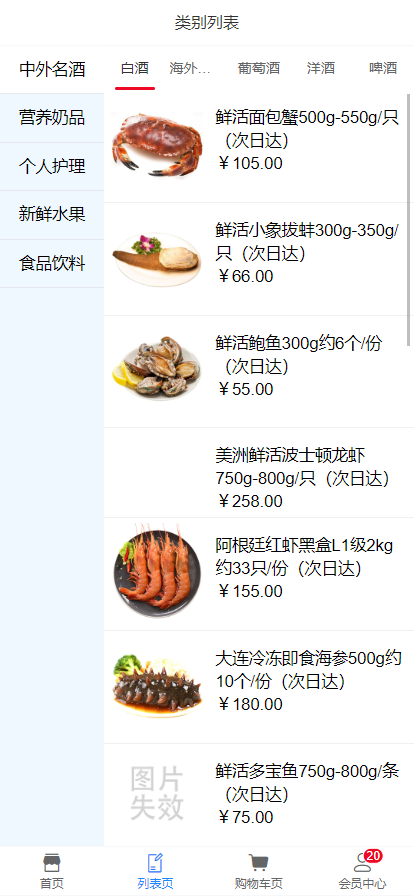
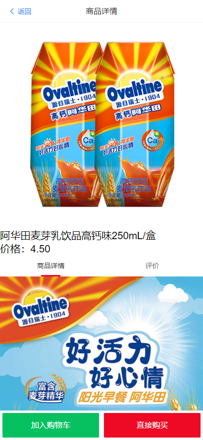
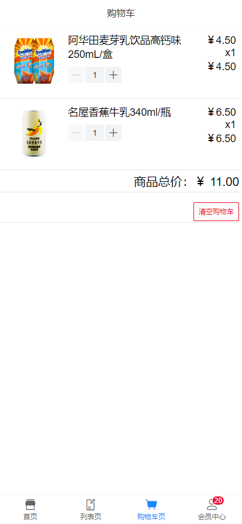
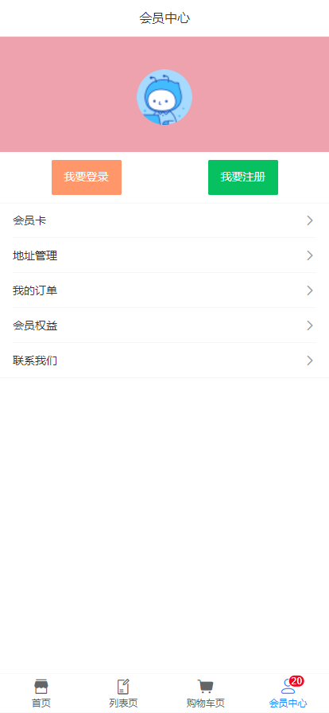

# Mini-Store

## 前言 Preface
本项目是学习技术胖大佬的电商项目教程所做，由于项目前端基于Vue，后端基于Koa，数据库采用MongoDB，是一套前端工程师绝佳的练手项目，因此整理后跟分享给大家，欢迎尝鲜🥮。

> 基于Vue.js & Koa 开发的H5购物商城


## 功能 Features
- 商城首页
- 商品分类
- 商品详情页
- 购物车
- 个人中心……


## 如何运行 How to run?

### 前端 Front
``` bash
# 安装依赖
npm install

# 运行项目（port:8080）
npm run dev

# 构建
npm run build

# 构建&查看构建报告
npm run build --report
```

### 后端 Backend
> 后端部分运行稍微复杂，需要先安装MongoDB，出于快速部署目的，此处采用docker部署（ps: Docker是21世纪开发人员必备技能 ）


``` bash

# 拉取镜像
docker pull mongo:latest

# 运行镜像
docker run -itd --name mongo -p 27017:27017 mongo

# 更新连接配置
/service/src/database/init.js
const db = "mongodb://你的MongoDB服务器地址/smile-db";
eg: const db = "mongodb://localhost/smile-db";

# 启动后端 可以看到：[Server] starting at port 3000
node .\service\src\index.js

# 初始化数据（控制台可以看到初始化过程）

# 1.初始化商品数据
浏览器访问 localhost:3000/goods/insertAllGoodsInfo

# 2.初始化category数据
浏览器访问 localhost:3000/goods/insertAllCategory

# 3.初始化SubCategory数据
浏览器访问 localhost:3000/goods/insertAllCategorySub

```

## 技术栈 Stack
- **前端：**`Vue`+`Vue-router`+`Vuex`+`Vant-ui`+`Axios`
- **后端：**`Koa`+`Koa-router`+`mongoose`
- **数据库：**`MongoDB`


## 项目截图 Shortcut
> http://localhost:8080

- 项目首页

 

- 商品分类

 

- 商品详情

 

- 购物车

 

- 个人中心

 